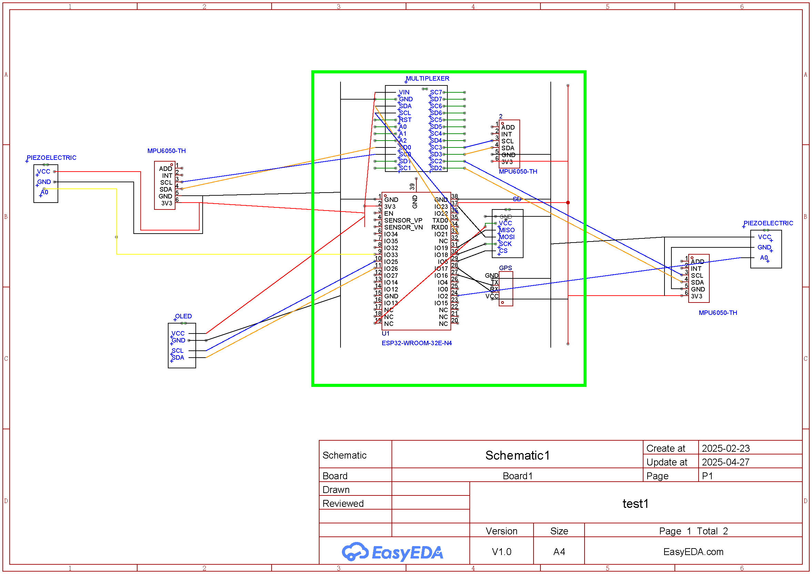

# Wearable Biomechanics Monitor

The Wearable Biomechanical Monitor is a sophisticated system designed to capture and analyze human movement data in real-time. By integrating multiple sensors and modules, it offers comprehensive insights into biomechanical activities.​

**Key Features:**

- Multi-IMU Integration: Utilizes three MPU6050 sensors positioned on different body parts (e.g., right leg, left leg, chest) to capture detailed motion data.​
- GPS Tracking: Employs a GPS module to record location, speed, and distance traveled, enhancing the context of movement data.​
-  Step Detection: Incorporates piezoelectric sensors to detect and categorize steps (normal or strong) for both feet, providing granular activity metrics.​
-  Data Logging: Stores collected data on an SD card in CSV format, facilitating post-analysis and long-term monitoring.​
-  Real-Time Display: Features an SH110X-based OLED display to present real-time statistics, including time elapsed, speed, distance, and step count.​
-  Calibration and Filtering: Applies calibration offsets and filtering techniques to ensure data accuracy and reliability.​

**Applications:**

 - Sports Science: Monitor athletes' movements to optimize performance and prevent injuries.​
 - Rehabilitation: Track patients' progress during physical therapy sessions.​
 - Research: Collect data for studies in human biomechanics and movement analysis.​
 - Personal Fitness: Provide users with detailed insights into their physical activities.

## Hardware Components & Wiring
**Chest&Arm Wiring** 
 
- ESP32-WROOM-32U microcontroller
- GPS NEO-6M module
- 1.3" I²C OLED display (128×64)
- LiPo battery pack + charger
- Micro SD card module
  
**Legs Wiring**  
- 3× MPU6050 (accelerometer/gyro) modules
- 2× Piezoelectric modules 

## Full Scheamtics 

## Operation
**Once powered on, the device calibrates sensors and then displays live data on the OLED screen.** 

**Simultaneously, All readings with timestamps are logged to a CSV file on the SD card.**  **The GPS module appends location data every 1 second. The system runs on battery for ~6 hours with current firmware.**

## Credits
Project by Muntadher Saeed, Ameer Sarmad, Mohamed Ali Ahmed (Biomedical Engineering students at University Of Technology-Iraq). Uses [Adafruit MPU6050 library], [TinyGPS++], and other open-source code (see `Code/libraries` folder). Contributions welcome – please submit issues or pull requests.

## License
Licensed under MIT
