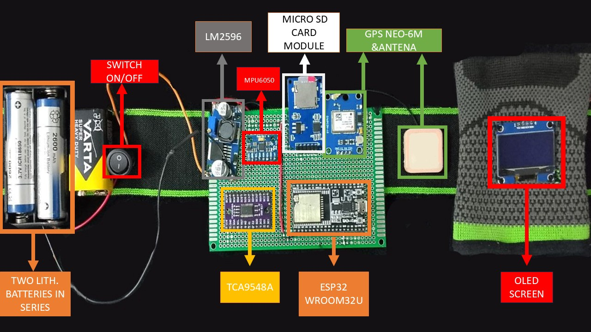
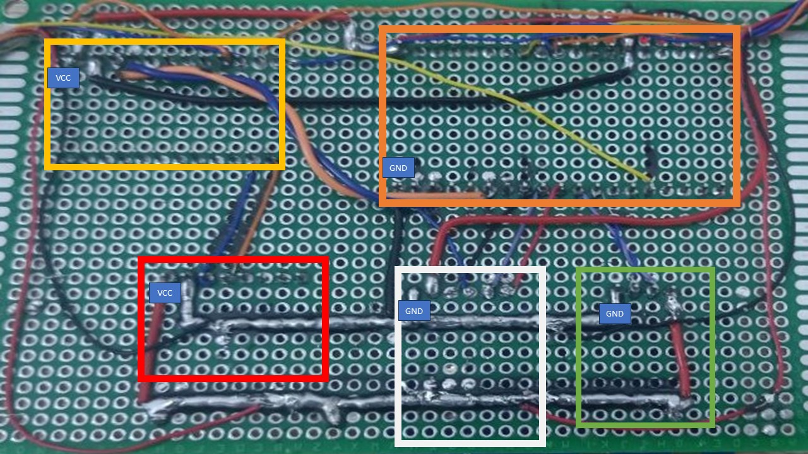
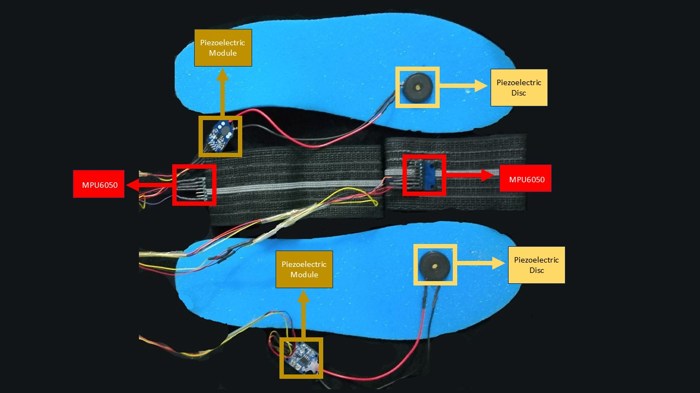
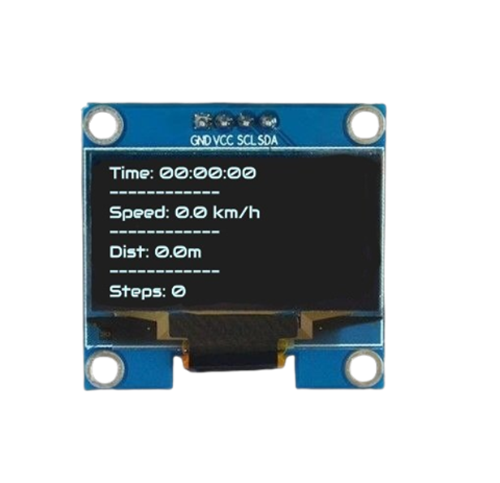
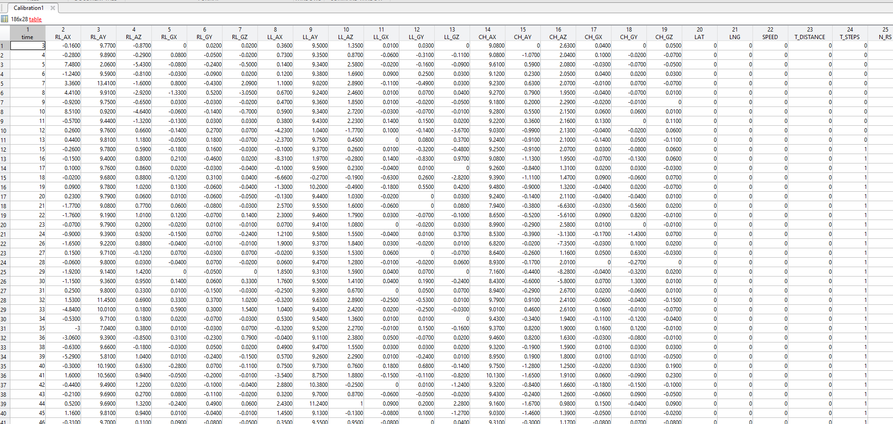

# Wearable Biomechanics Monitor

A wearable system for measuring gait and motion for athletes in real time, built with an ESP32 microcontroller.  
  
**Features:** Real-time display of motion data, GPS location logging, and power-efficient operation.

## Hardware Components & Wiring
**Chest&Arm Wiring** 
 
- ESP32-WROOM-32U microcontroller
- GPS NEO-6M module
- 1.3" I²C OLED display (128×64)
- LiPo battery pack + charger
- Micro SD card module
  
**Legs Wiring**  
- 3× MPU6050 (accelerometer/gyro) modules
- 2× Piezoelectric modules 

## Operation
Once powered on, the device calibrates sensors and then displays live data on the OLED screen 

Simultaneously, All readings with timestamps are logged to a CSV file on the SD card.  on the SD card. The GPS module appends location data every 1 second. The system runs on battery for ~6 hours with current firmware.

## Credits
Project by *Your Name* (Biomedical Engineering student). Uses [Adafruit MPU6050 library], [TinyGPS++], and other open-source code (see `Code/libraries` folder). Contributions welcome – please submit issues or pull requests.

## License
Licensed under MIT
